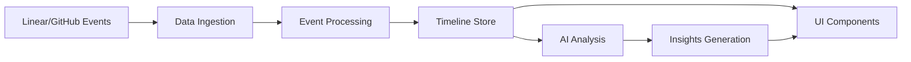

# Charlie Command Center

## Project Overview

Charlie-xyz is the central command center for visualizing and managing all Charlie automation instances across your development workflow. It provides a unified dashboard to monitor, track, and interact with Charlie's activities across Linear and GitHub, with optional AI-powered insights to enhance decision-making.

## Core Value Proposition

- **Unified Command Center**: Single dashboard for all Charlie instances and workflows
- **Real-time Visualization**: Live timeline view of Charlie's automation activities
- **Workflow Monitoring**: Track Charlie's progress on Linear issues and GitHub PRs
- **Interactive Controls**: Manage and direct Charlie's actions from one interface
- **AI-Enhanced Insights**: Optional intelligent analysis for workflow optimization

## Architecture

### Technology Stack

```yaml
Frontend:
  - Framework: Next.js 15.5.2 (App Router)
  - Runtime: React 19 RC
  - Language: TypeScript 5.x
  - Styling: Tailwind CSS v4
  - State: Jotai (UI), SWR (server cache)
  - Animation: Framer Motion
  - Icons: Phosphor Icons, Lucide React

AI Integration:
  - Primary: Anthropic Claude 3.5
  - Secondary: OpenAI GPT-4, Google Gemini
  - SDK: Vercel AI SDK
  - Runtime: Edge Functions

Infrastructure:
  - Deployment: Vercel
  - Database: PostgreSQL (Neon)
  - Analytics: PostHog
  - Monitoring: Sentry
  - Email: Resend
```

### Project Structure

```
charlie-xyz/
├── apps/
│   └── app/                    # Main Next.js application
│       ├── src/
│       │   ├── app/            # App router pages and API routes
│       │   ├── components/     # React components
│       │   ├── lib/           # Utilities and helpers
│       │   ├── providers/     # Context providers
│       │   └── types/         # TypeScript definitions
│       └── public/            # Static assets
├── packages/
│   ├── design/                # Shared UI component library
│   ├── next-config/          # Shared Next.js configuration
│   ├── seo/                  # SEO utilities
│   └── typescript-config/    # Shared TypeScript configuration
└── .ruler/                   # AI tool configuration
```

## Key Features

### 1. Workflow Timeline
- Chronological visualization of all workflow events
- Color-coded by provider (Linear/GitHub)
- Expandable event details with full payload inspection
- Real-time updates as events occur

### 2. AI-Powered Analysis
- Multiple AI model support (Claude, GPT-4, Gemini)
- Configurable model selection per analysis
- Structured insight generation
- Predictive workflow completion estimates

### 3. Insights Dashboard
- High-level workflow summaries
- Key metrics and KPIs
- Bottleneck identification
- Actionable recommendations
- Trend analysis and patterns

### 4. Event Filtering
- Filter by provider (Linear, GitHub)
- Filter by event type (issues, PRs, commits)
- Filter by actor type (human, Charlie, bot)
- Combine filters for precise analysis

### 5. Settings & Configuration
- AI model selection
- Theme customization (light/dark/system)
- Performance settings
- Export and reporting options

## Data Flow



## Workflow Event Types

### Linear Events
- `issue.created` - New issue creation
- `issue.assigned` - Issue assignment
- `issue.status_changed` - Status updates
- `issue.labeled` - Label additions
- `issue.commented` - Comments added
- `issue.linked` - External links added
- `issue.closed` - Issue completion

### GitHub Events
- `pr.opened` - Pull request creation
- `pr.draft` - Draft PR status
- `pr.ready_for_review` - PR ready
- `pr.review_requested` - Review requests
- `pr.review_submitted` - Review completion
- `pr.commented` - PR comments
- `pr.commit_pushed` - New commits
- `pr.merged` - PR merged
- `ci.check_run` - CI/CD status

## AI Analysis Capabilities

### Insight Types
1. **Workflow Narratives**: Human-readable stories of what happened
2. **Performance Metrics**: Quantitative measurements
3. **Bottleneck Detection**: Identification of delays and blockers
4. **Next Steps**: Recommended actions for each workflow
5. **Process Recommendations**: System-wide improvements

### Analysis Dimensions
- **Temporal**: Time-based patterns and trends
- **Actor-based**: Individual and team performance
- **Type-based**: Issue vs PR patterns
- **Priority-based**: Urgency and importance ranking
- **Dependency**: Cross-workflow relationships

## Security & Compliance

### Authentication
- API key validation for AI services
- Rate limiting for API endpoints
- Input sanitization and validation
- Error masking in production

### Data Privacy
- No PII in event payloads
- Configurable data retention
- GDPR-compliant data handling
- Audit logging for access

## Performance Optimization

### Frontend
- Server components for initial render
- Client-side caching with SWR
- Code splitting and lazy loading
- Optimized bundle size
- Image optimization

### Backend
- Edge runtime for API routes
- Response caching strategies
- Efficient data structures
- Pagination for large datasets
- Streaming responses (planned)

## Development Workflow

### Local Development
```bash
# Install dependencies
pnpm install

# Start development server
pnpm dev

# Run type checking
pnpm typecheck

# Run linting and formatting
pnpm check
```

### Testing Strategy
- Unit tests for utilities
- Integration tests for API routes
- E2E tests for critical paths
- Visual regression testing
- Performance benchmarking

### Deployment
- Automatic deployment via Vercel
- Preview deployments for PRs
- Environment-based configuration
- Rollback capabilities
- Zero-downtime deployments

## Future Roadmap

### Near-term (Q1 2025)
- Real-time webhook integration
- Custom insight templates
- Team collaboration features
- Advanced filtering options
- Export functionality

### Mid-term (Q2 2025)
- Historical trend analysis
- Custom workflow automation
- Integration with Jira/Asana
- Machine learning predictions
- Mobile application

### Long-term (Q3-Q4 2025)
- Multi-organization support
- Custom AI model training
- Advanced reporting suite
- API marketplace
- Enterprise features

## Support & Documentation

### Resources
- API Documentation: `/docs/api`
- User Guide: `/docs/user-guide`
- Developer Guide: `/docs/developer`
- Troubleshooting: `/docs/troubleshooting`

### Community
- GitHub Issues for bug reports
- Discussions for feature requests
- Discord for real-time support
- Stack Overflow for Q&A