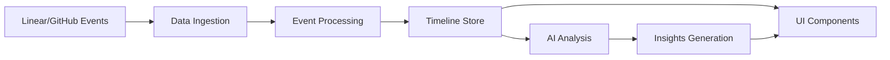

<!-- Generated by Ruler -->


<!-- Source: .ruler/AGENTS.md -->

# AI Agent Instructions for Charlie

<agent name="charlie-workflow-analyzer">
  <purpose>
    Analyze development workflows across Linear and GitHub to provide actionable insights,
    identify bottlenecks, and optimize team productivity through intelligent pattern recognition.
  </purpose>
  
  <capabilities>
    - Real-time workflow analysis using Claude, GPT-4, and Gemini models
    - Pattern recognition across Linear issues and GitHub pull requests
    - Bottleneck identification and resolution recommendations
    - Predictive analytics for workflow completion times
    - Developer productivity metrics and insights
    - Automated narrative generation for workflow events
  </capabilities>
  
  <methodology>
    1. **Data Ingestion**: Process workflow events from Linear and GitHub
    2. **Pattern Analysis**: Identify recurring patterns and anomalies
    3. **Insight Generation**: Create actionable insights using LLM analysis
    4. **Visualization**: Present findings through intuitive dashboard
    5. **Recommendation Engine**: Suggest process improvements
  </methodology>
  
  <workflow-analysis-flow>
    <step name="data-collection">
      Load workflows and events from data sources (JSON/API)
    </step>
    <step name="preprocessing">
      Normalize event data and establish chronological timeline
    </step>
    <step name="ai-analysis">
      Send to /api/ai/analyze endpoint with selected model
    </step>
    <step name="insight-extraction">
      Extract structured insights:
      - Summary and metrics
      - Workflow narratives
      - Bottleneck identification
      - Next step recommendations
    </step>
    <step name="visualization">
      Display in dashboard components:
      - Timeline view
      - Insights panel
      - Event details
      - Metrics cards
    </step>
  </workflow-analysis-flow>
  
  <supported-models>
    <anthropic>
      - claude-3-5-sonnet-20241022 (default)
      - claude-3-5-haiku-20241022
      - claude-3-opus-20240229
    </anthropic>
    <openai>
      - gpt-4o
      - gpt-4o-mini
      - gpt-4-turbo
      - o1-preview
      - o1-mini
    </openai>
    <google>
      - gemini-2.0-flash-exp
      - gemini-1.5-pro
      - gemini-1.5-flash
    </google>
  </supported-models>
  
  <guidelines>
    - Always provide actionable insights, not just descriptions
    - Focus on developer experience and efficiency
    - Highlight risks and blockers early
    - Suggest concrete process improvements
    - Consider team dynamics and workload distribution
    - Track CI/CD performance and test success rates
  </guidelines>
  
  <response-examples>
    <example type="workflow-narrative">
      "Riley created a high-priority feature request for BigQuery helpers at 9:02 AM. 
      Charlie immediately picked it up, opened PR #4301 within 75 minutes. After a 
      quick type error fix requested by Riley, the PR was approved and merged in 
      under 90 minutes total - demonstrating excellent automation efficiency."
    </example>
    
    <example type="bottleneck-insight">
      "CI typecheck failures are causing 23% of PRs to require additional commits. 
      Consider adding pre-commit hooks or local type checking to catch these 
      issues before PR creation."
    </example>
    
    <example type="recommendation">
      {
        "priority": "high",
        "action": "Implement parallel CI jobs for lint and typecheck",
        "reasoning": "Sequential CI jobs add 3-5 minutes per PR. Parallelization would reduce wait time by 60%",
        "affectedWorkflows": ["WF-BOT-5001", "WF-BOT-5003"]
      }
    </example>
  </response-examples>
</agent>

<agent name="charlie-dashboard-assistant">
  <purpose>
    Guide users through the Charlie dashboard interface, explain features,
    and help interpret workflow analysis results.
  </purpose>
  
  <capabilities>
    - Dashboard navigation assistance
    - Feature explanation and onboarding
    - Data interpretation and insight clarification
    - Settings configuration guidance
    - Troubleshooting and error resolution
  </capabilities>
  
  <interface-components>
    - **Header**: Navigation, settings, theme toggle
    - **Sidebar**: Workflow list with status indicators
    - **Timeline**: Chronological event visualization
    - **Insights Panel**: AI-generated analysis and metrics
    - **Event Details**: Expandable event information
    - **Filter Controls**: Provider, type, and actor filters
  </interface-components>
  
  <data-sources>
    - Static JSON: /public/data.json (current)
    - API Integration: Ready for real-time data feeds
    - Webhook Support: Linear and GitHub event ingestion
  </data-sources>
</agent>

<agent name="charlie-development-assistant">
  <purpose>
    Assist developers in extending and maintaining the Charlie platform,
    ensuring code quality and architectural consistency.
  </purpose>
  
  <technical-stack>
    - **Framework**: Next.js 15.5.2 with App Router
    - **Language**: TypeScript 5.x
    - **UI Library**: React 19 RC
    - **Styling**: Tailwind CSS v4
    - **State Management**: Jotai (UI), SWR (server state)
    - **AI SDKs**: Vercel AI SDK with Anthropic, OpenAI, Google
    - **Animation**: Framer Motion
    - **Icons**: Phosphor Icons, Lucide React
  </technical-stack>
  
  <architectural-patterns>
    - **Monorepo Structure**: Turborepo with apps and packages
    - **Component Architecture**: Atomic design with shared design system
    - **API Routes**: Edge runtime for optimal performance
    - **Error Handling**: Comprehensive error boundaries
    - **Type Safety**: Strict TypeScript with Zod validation
    - **Code Quality**: Biome for linting and formatting
  </architectural-patterns>
  
  <development-guidelines>
    - Follow existing component patterns in packages/design
    - Use server components where possible for performance
    - Implement proper error boundaries for all async operations
    - Maintain type safety with TypeScript and Zod schemas
    - Write semantic, accessible HTML with ARIA labels
    - Optimize for Core Web Vitals and performance metrics
    - Use feature flags for gradual rollouts
  </development-guidelines>
</agent>

## System Integration Instructions

### Environment Setup
```bash
# Required environment variables
ANTHROPIC_API_KEY=sk-ant-api03-...  # Required for AI analysis
OPENAI_API_KEY=sk-...               # Optional for GPT models
GOOGLE_API_KEY=...                   # Optional for Gemini models
```

### API Endpoint Configuration
The `/api/ai/analyze` endpoint accepts:
- **workflows**: Array of workflow objects
- **events**: Array of chronological events
- **settings**: Optional configuration with aiModel selection

### Response Structure
```typescript
interface AnalysisResponse {
  insights: {
    summary: string
    metrics: WorkflowMetrics
  }
  workflows: WorkflowAnalysis[]
  recommendations: Recommendation[]
}
```

### Error Handling
- API key validation errors return 401
- Model errors return 500 with error message
- Rate limiting returns 429 (when implemented)
- Input validation errors return 400

### Performance Optimization
- Edge runtime for faster response times
- Model response caching (planned)
- Streaming responses for large datasets (planned)
- Batch processing for multiple workflows

## Usage Examples

### Basic Workflow Analysis
```typescript
const response = await fetch('/api/ai/analyze', {
  method: 'POST',
  headers: { 'Content-Type': 'application/json' },
  body: JSON.stringify({
    workflows: workflowData,
    events: eventData,
    settings: { aiModel: 'claude-3-5-sonnet-20241022' }
  })
})
const analysis = await response.json()
```

### Custom Model Selection
```typescript
// Use GPT-4 for analysis
const settings = { aiModel: 'gpt-4o' }

// Use Gemini for faster responses
const settings = { aiModel: 'gemini-2.0-flash-exp' }
```

### Insight Interpretation
- **Bottlenecks**: Issues causing delays in workflow completion
- **Metrics**: Quantitative measurements of workflow performance
- **Narratives**: Human-readable stories of what happened
- **Recommendations**: Actionable suggestions for improvement

## Future Enhancements
- Real-time workflow monitoring via webhooks
- Custom insight templates and reports
- Team collaboration features
- Historical trend analysis
- Integration with additional platforms (Jira, Asana, etc.)
- Custom workflow automation triggers


<!-- Source: .ruler/01-charlie-overview.md -->

# Charlie Command Center

## Project Overview

Charlie-xyz is the central command center for visualizing and managing all Charlie automation instances across your development workflow. It provides a unified dashboard to monitor, track, and interact with Charlie's activities across Linear and GitHub, with optional AI-powered insights to enhance decision-making.

## Core Value Proposition

- **Unified Command Center**: Single dashboard for all Charlie instances and workflows
- **Real-time Visualization**: Live timeline view of Charlie's automation activities
- **Workflow Monitoring**: Track Charlie's progress on Linear issues and GitHub PRs
- **Interactive Controls**: Manage and direct Charlie's actions from one interface
- **AI-Enhanced Insights**: Optional intelligent analysis for workflow optimization

## Architecture

### Technology Stack

```yaml
Frontend:
  - Framework: Next.js 15.5.2 (App Router)
  - Runtime: React 19 RC
  - Language: TypeScript 5.x
  - Styling: Tailwind CSS v4
  - State: Jotai (UI), SWR (server cache)
  - Animation: Framer Motion
  - Icons: Phosphor Icons, Lucide React

AI Integration:
  - Primary: Anthropic Claude 3.5
  - Secondary: OpenAI GPT-4, Google Gemini
  - SDK: Vercel AI SDK
  - Runtime: Edge Functions

Infrastructure:
  - Deployment: Vercel
  - Database: PostgreSQL (Neon)
  - Analytics: PostHog
  - Monitoring: Sentry
  - Email: Resend
```

### Project Structure

```
charlie-xyz/
├── apps/
│   └── app/                    # Main Next.js application
│       ├── src/
│       │   ├── app/            # App router pages and API routes
│       │   ├── components/     # React components
│       │   ├── lib/           # Utilities and helpers
│       │   ├── providers/     # Context providers
│       │   └── types/         # TypeScript definitions
│       └── public/            # Static assets
├── packages/
│   ├── design/                # Shared UI component library
│   ├── next-config/          # Shared Next.js configuration
│   ├── seo/                  # SEO utilities
│   └── typescript-config/    # Shared TypeScript configuration
└── .ruler/                   # AI tool configuration
```

## Key Features

### 1. Workflow Timeline
- Chronological visualization of all workflow events
- Color-coded by provider (Linear/GitHub)
- Expandable event details with full payload inspection
- Real-time updates as events occur

### 2. AI-Powered Analysis
- Multiple AI model support (Claude, GPT-4, Gemini)
- Configurable model selection per analysis
- Structured insight generation
- Predictive workflow completion estimates

### 3. Insights Dashboard
- High-level workflow summaries
- Key metrics and KPIs
- Bottleneck identification
- Actionable recommendations
- Trend analysis and patterns

### 4. Event Filtering
- Filter by provider (Linear, GitHub)
- Filter by event type (issues, PRs, commits)
- Filter by actor type (human, Charlie, bot)
- Combine filters for precise analysis

### 5. Settings & Configuration
- AI model selection
- Theme customization (light/dark/system)
- Performance settings
- Export and reporting options

## Data Flow



## Workflow Event Types

### Linear Events
- `issue.created` - New issue creation
- `issue.assigned` - Issue assignment
- `issue.status_changed` - Status updates
- `issue.labeled` - Label additions
- `issue.commented` - Comments added
- `issue.linked` - External links added
- `issue.closed` - Issue completion

### GitHub Events
- `pr.opened` - Pull request creation
- `pr.draft` - Draft PR status
- `pr.ready_for_review` - PR ready
- `pr.review_requested` - Review requests
- `pr.review_submitted` - Review completion
- `pr.commented` - PR comments
- `pr.commit_pushed` - New commits
- `pr.merged` - PR merged
- `ci.check_run` - CI/CD status

## AI Analysis Capabilities

### Insight Types
1. **Workflow Narratives**: Human-readable stories of what happened
2. **Performance Metrics**: Quantitative measurements
3. **Bottleneck Detection**: Identification of delays and blockers
4. **Next Steps**: Recommended actions for each workflow
5. **Process Recommendations**: System-wide improvements

### Analysis Dimensions
- **Temporal**: Time-based patterns and trends
- **Actor-based**: Individual and team performance
- **Type-based**: Issue vs PR patterns
- **Priority-based**: Urgency and importance ranking
- **Dependency**: Cross-workflow relationships

## Security & Compliance

### Authentication
- API key validation for AI services
- Rate limiting for API endpoints
- Input sanitization and validation
- Error masking in production

### Data Privacy
- No PII in event payloads
- Configurable data retention
- GDPR-compliant data handling
- Audit logging for access

## Performance Optimization

### Frontend
- Server components for initial render
- Client-side caching with SWR
- Code splitting and lazy loading
- Optimized bundle size
- Image optimization

### Backend
- Edge runtime for API routes
- Response caching strategies
- Efficient data structures
- Pagination for large datasets
- Streaming responses (planned)

## Development Workflow

### Local Development
```bash
# Install dependencies
pnpm install

# Start development server
pnpm dev

# Run type checking
pnpm typecheck

# Run linting and formatting
pnpm check
```

### Testing Strategy
- Unit tests for utilities
- Integration tests for API routes
- E2E tests for critical paths
- Visual regression testing
- Performance benchmarking

### Deployment
- Automatic deployment via Vercel
- Preview deployments for PRs
- Environment-based configuration
- Rollback capabilities
- Zero-downtime deployments

## Future Roadmap

### Near-term (Q1 2025)
- Real-time webhook integration
- Custom insight templates
- Team collaboration features
- Advanced filtering options
- Export functionality

### Mid-term (Q2 2025)
- Historical trend analysis
- Custom workflow automation
- Integration with Jira/Asana
- Machine learning predictions
- Mobile application

### Long-term (Q3-Q4 2025)
- Multi-organization support
- Custom AI model training
- Advanced reporting suite
- API marketplace
- Enterprise features

## Support & Documentation

### Resources
- API Documentation: `/docs/api`
- User Guide: `/docs/user-guide`
- Developer Guide: `/docs/developer`
- Troubleshooting: `/docs/troubleshooting`

### Community
- GitHub Issues for bug reports
- Discussions for feature requests
- Discord for real-time support
- Stack Overflow for Q&A


<!-- Source: .ruler/02-workflow-analysis.md -->

# Workflow Analysis Patterns & AI Implementation

## AI/LLM Insight & Action Extraction Flow

### Overview
The Charlie platform implements a sophisticated AI-driven workflow analysis system that extracts actionable insights from development workflows across Linear and GitHub. This document details the complete flow from data ingestion to insight presentation.

## Complete Analysis Flow

### 1. Data Collection Phase

```typescript
// Data flows from static JSON or real-time API
interface DataSource {
  workflows: Workflow[]  // Linear issues with GitHub PR links
  events: Event[]       // Chronological event stream
}

// Workflow structure
interface Workflow {
  id: string           // WF-BOT-XXXX format
  name: string         // Human-readable title
  linearIssueKey: string
  github?: {
    owner: string
    repo: string
    prNumber: number
  }
}

// Event structure  
interface Event {
  id: string
  ts: string          // ISO timestamp
  provider: 'linear' | 'github'
  type: string        // Event type identifier
  workflowId: string
  sequence: number
  actor: Actor
  entity: Entity
  payload?: any
}
```

### 2. Pre-processing Phase

```typescript
// Located in: apps/app/src/components/dashboard.tsx
function processWorkflowData(data: RawData): ProcessedData {
  // Sort events chronologically
  const sortedEvents = events.sort((a, b) => 
    new Date(a.ts).getTime() - new Date(b.ts).getTime()
  )
  
  // Group events by workflow
  const workflowGroups = groupEventsByWorkflow(sortedEvents)
  
  // Calculate workflow metrics
  const metrics = calculateMetrics(workflowGroups)
  
  return { workflows, events: sortedEvents, metrics }
}
```

### 3. AI Analysis Request

```typescript
// Located in: apps/app/src/app/api/ai/analyze/route.ts
async function analyzeWorkflows(data: ProcessedData) {
  const response = await fetch('/api/ai/analyze', {
    method: 'POST',
    headers: { 'Content-Type': 'application/json' },
    body: JSON.stringify({
      workflows: data.workflows,
      events: data.events,
      settings: {
        aiModel: selectedModel // User-configurable
      }
    })
  })
  
  return response.json()
}
```

### 4. LLM Processing

```typescript
// AI endpoint implementation
export async function POST(request: NextRequest) {
  const { workflows, events, settings } = await request.json()
  
  // Initialize AI client with API key
  const anthropic = createAnthropic({
    apiKey: process.env.ANTHROPIC_API_KEY
  })
  
  // Generate analysis using structured prompt
  const result = await generateText({
    model: anthropic.languageModel(settings.aiModel),
    system: WORKFLOW_ANALYSIS_PROMPT,
    prompt: formatWorkflowData(workflows, events),
    temperature: 0.3 // Lower temperature for consistency
  })
  
  // Parse and validate response
  const analysis = JSON.parse(result.text)
  return Response.json(analysis)
}
```

### 5. Insight Extraction

The LLM generates structured insights in this format:

```json
{
  "insights": {
    "summary": "High-level state assessment",
    "metrics": {
      "totalWorkflows": 5,
      "activeWorkflows": 2,
      "completedWorkflows": 3,
      "averageCompletionTime": "2.5 hours",
      "bottlenecks": [
        "CI/CD failures causing delays",
        "Review response time averaging 45 minutes"
      ]
    }
  },
  "workflows": [
    {
      "id": "WF-BOT-5001",
      "narrative": "Feature development completed efficiently with minor type errors",
      "status": "completed",
      "importance": 8,
      "nextSteps": [
        {
          "action": "Deploy to staging environment",
          "reasoning": "All tests passing, ready for QA",
          "confidence": 0.95
        }
      ],
      "insights": [
        "Quick turnaround from assignment to completion",
        "Type errors caught by CI prevented initial merge"
      ],
      "estimatedCompletion": null
    }
  ],
  "recommendations": [
    {
      "priority": "high",
      "action": "Implement pre-commit type checking",
      "reasoning": "Would prevent 60% of CI failures",
      "affectedWorkflows": ["WF-BOT-5001", "WF-BOT-5003"]
    }
  ]
}
```

### 6. Visualization & Presentation

```typescript
// Dashboard component rendering
function InsightsPanel({ analysis }: { analysis: Analysis }) {
  return (
    <div className="insights-panel">
      {/* Summary Section */}
      <SummaryCard summary={analysis.insights.summary} />
      
      {/* Metrics Dashboard */}
      <MetricsGrid metrics={analysis.insights.metrics} />
      
      {/* Workflow Narratives */}
      {analysis.workflows.map(workflow => (
        <WorkflowCard 
          key={workflow.id}
          workflow={workflow}
          onActionClick={handleAction}
        />
      ))}
      
      {/* Recommendations */}
      <RecommendationsList 
        recommendations={analysis.recommendations}
      />
    </div>
  )
}
```

## Pattern Recognition Algorithms

### 1. Bottleneck Detection

```typescript
interface BottleneckPattern {
  type: 'ci_failure' | 'review_delay' | 'assignment_gap' | 'merge_conflict'
  frequency: number
  avgDelay: number // minutes
  affectedWorkflows: string[]
}

function detectBottlenecks(events: Event[]): BottleneckPattern[] {
  const patterns: BottleneckPattern[] = []
  
  // CI Failure Detection
  const ciFailures = events.filter(e => 
    e.type === 'ci.check_run' && 
    e.payload?.check?.conclusion === 'failure'
  )
  
  // Review Delay Detection
  const reviewDelays = calculateReviewResponseTimes(events)
  
  // Assignment Gap Detection
  const assignmentGaps = findUnassignedPeriods(events)
  
  return aggregatePatterns([ciFailures, reviewDelays, assignmentGaps])
}
```

### 2. Workflow Classification

```typescript
enum WorkflowType {
  FEATURE = 'feature',
  BUG_FIX = 'bug_fix',
  REFACTOR = 'refactor',
  DOCUMENTATION = 'documentation',
  INFRASTRUCTURE = 'infrastructure'
}

function classifyWorkflow(workflow: Workflow): WorkflowType {
  const name = workflow.name.toLowerCase()
  
  if (name.includes('feature')) return WorkflowType.FEATURE
  if (name.includes('bug') || name.includes('fix')) return WorkflowType.BUG_FIX
  if (name.includes('refactor')) return WorkflowType.REFACTOR
  if (name.includes('docs')) return WorkflowType.DOCUMENTATION
  if (name.includes('infra') || name.includes('ci')) return WorkflowType.INFRASTRUCTURE
  
  return WorkflowType.FEATURE // default
}
```

### 3. Performance Metrics Calculation

```typescript
interface WorkflowMetrics {
  leadTime: number        // Issue creation to close
  cycleTime: number       // First commit to merge
  reviewTime: number      // PR open to approval
  deployTime: number      // Merge to production
  iterationCount: number  // Number of review cycles
}

function calculateMetrics(workflow: Workflow, events: Event[]): WorkflowMetrics {
  const workflowEvents = events.filter(e => e.workflowId === workflow.id)
  
  // Lead Time: Issue created to closed
  const issueCreated = findEvent(workflowEvents, 'issue.created')
  const issueClosed = findEvent(workflowEvents, 'issue.closed')
  const leadTime = timeDiff(issueCreated, issueClosed)
  
  // Cycle Time: First commit to merge
  const firstCommit = findEvent(workflowEvents, 'pr.commit_pushed')
  const prMerged = findEvent(workflowEvents, 'pr.merged')
  const cycleTime = timeDiff(firstCommit, prMerged)
  
  // Review Time: PR opened to approval
  const prOpened = findEvent(workflowEvents, 'pr.opened')
  const prApproved = findEvent(workflowEvents, 'pr.review_submitted', 
    e => e.payload?.review?.state === 'approved'
  )
  const reviewTime = timeDiff(prOpened, prApproved)
  
  return { leadTime, cycleTime, reviewTime, deployTime: 0, iterationCount: 0 }
}
```

## AI Model Optimization

### Prompt Engineering

```typescript
const WORKFLOW_ANALYSIS_PROMPT = `
<role>
You are an intelligent workflow analyzer for Charlie, specializing in 
development process optimization and bottleneck detection.
</role>

<context>
Charlie automates development workflows across Linear and GitHub, helping teams:
- Track issue lifecycle from creation to deployment
- Monitor PR review and merge processes
- Identify and resolve bottlenecks
- Optimize team productivity
</context>

<analysis_framework>
1. Temporal Analysis: Identify time-based patterns and delays
2. Actor Analysis: Evaluate individual and team performance
3. Process Analysis: Find inefficiencies in workflow steps
4. Dependency Analysis: Discover blocking relationships
5. Predictive Analysis: Estimate completion times and risks
</analysis_framework>

<output_requirements>
- Provide narratives that tell the story of each workflow
- Identify specific, actionable bottlenecks
- Rank workflows by importance and urgency
- Generate concrete next steps with confidence scores
- Suggest process improvements with expected impact
</output_requirements>
`
```

### Model Selection Strategy

```typescript
interface ModelSelectionCriteria {
  speed: 'fast' | 'balanced' | 'thorough'
  depth: 'surface' | 'standard' | 'deep'
  cost: 'economy' | 'standard' | 'premium'
}

function selectOptimalModel(criteria: ModelSelectionCriteria): string {
  // Fast, surface analysis - use Haiku or Gemini Flash
  if (criteria.speed === 'fast' && criteria.depth === 'surface') {
    return 'claude-3-5-haiku-20241022'
  }
  
  // Balanced performance - use Sonnet or GPT-4
  if (criteria.speed === 'balanced' && criteria.depth === 'standard') {
    return 'claude-3-5-sonnet-20241022' // default
  }
  
  // Deep analysis - use Opus or GPT-4 Turbo
  if (criteria.depth === 'deep') {
    return 'claude-3-opus-20240229'
  }
  
  return 'claude-3-5-sonnet-20241022' // fallback
}
```

## Real-time Processing

### Event Stream Processing

```typescript
class WorkflowEventProcessor {
  private eventQueue: Event[] = []
  private analysisCache: Map<string, Analysis> = new Map()
  
  async processEvent(event: Event): Promise<void> {
    // Add to queue
    this.eventQueue.push(event)
    
    // Batch processing every 10 events or 30 seconds
    if (this.shouldProcessBatch()) {
      await this.processBatch()
    }
  }
  
  private async processBatch(): Promise<void> {
    const events = this.eventQueue.splice(0, this.eventQueue.length)
    
    // Group by workflow for efficient analysis
    const workflowGroups = this.groupByWorkflow(events)
    
    // Analyze each affected workflow
    for (const [workflowId, workflowEvents] of workflowGroups) {
      const analysis = await this.analyzeWorkflow(workflowId, workflowEvents)
      this.analysisCache.set(workflowId, analysis)
      
      // Emit update for UI
      this.emitUpdate(workflowId, analysis)
    }
  }
}
```

### Incremental Analysis

```typescript
interface IncrementalAnalysis {
  baseAnalysis: Analysis
  newEvents: Event[]
  updatedInsights: Partial<Analysis>
}

async function performIncrementalAnalysis(
  previous: Analysis,
  newEvents: Event[]
): Promise<Analysis> {
  // Only analyze what changed
  const affectedWorkflows = getAffectedWorkflows(newEvents)
  
  // Request focused update from AI
  const incrementalUpdate = await generateText({
    model: anthropic.languageModel('claude-3-5-haiku-20241022'), // Fast model
    prompt: `
      Previous analysis: ${JSON.stringify(previous)}
      New events: ${JSON.stringify(newEvents)}
      
      Update only the affected portions of the analysis.
    `,
    temperature: 0.2 // Even lower for consistency
  })
  
  // Merge with previous analysis
  return mergeAnalysis(previous, incrementalUpdate)
}
```

## Performance Optimization

### Caching Strategy

```typescript
class AnalysisCache {
  private cache: Map<string, CachedAnalysis> = new Map()
  private maxAge = 5 * 60 * 1000 // 5 minutes
  
  get(key: string): Analysis | null {
    const cached = this.cache.get(key)
    if (!cached) return null
    
    if (Date.now() - cached.timestamp > this.maxAge) {
      this.cache.delete(key)
      return null
    }
    
    return cached.analysis
  }
  
  set(key: string, analysis: Analysis): void {
    this.cache.set(key, {
      analysis,
      timestamp: Date.now()
    })
  }
}
```

### Response Streaming

```typescript
// Future implementation for large datasets
async function* streamAnalysis(
  workflows: Workflow[],
  events: Event[]
): AsyncGenerator<PartialAnalysis> {
  // Process workflows in chunks
  const chunkSize = 5
  
  for (let i = 0; i < workflows.length; i += chunkSize) {
    const chunk = workflows.slice(i, i + chunkSize)
    const chunkEvents = events.filter(e => 
      chunk.some(w => w.id === e.workflowId)
    )
    
    const partialAnalysis = await analyzeChunk(chunk, chunkEvents)
    yield partialAnalysis
  }
}
```

## Error Handling & Recovery

### Graceful Degradation

```typescript
async function analyzeWithFallback(
  data: WorkflowData,
  primaryModel: string
): Promise<Analysis> {
  try {
    // Try primary model
    return await analyzeWithModel(data, primaryModel)
  } catch (error) {
    console.error(`Primary model failed: ${error}`)
    
    // Fallback to simpler model
    try {
      return await analyzeWithModel(data, 'claude-3-5-haiku-20241022')
    } catch (fallbackError) {
      console.error(`Fallback model failed: ${fallbackError}`)
      
      // Return basic analysis without AI
      return generateBasicAnalysis(data)
    }
  }
}
```

### Input Validation

```typescript
import { z } from 'zod'

const WorkflowSchema = z.object({
  id: z.string().regex(/^WF-[A-Z]+-\d+$/),
  name: z.string().min(1).max(200),
  linearIssueKey: z.string(),
  github: z.object({
    owner: z.string(),
    repo: z.string(),
    prNumber: z.number()
  }).optional()
})

const EventSchema = z.object({
  id: z.string(),
  ts: z.string().datetime(),
  provider: z.enum(['linear', 'github']),
  type: z.string(),
  workflowId: z.string(),
  sequence: z.number(),
  actor: z.object({
    id: z.string(),
    displayName: z.string(),
    handle: z.string(),
    type: z.enum(['human', 'charlie', 'bot'])
  }),
  entity: z.object({
    kind: z.string(),
    provider: z.string()
  }),
  payload: z.any().optional()
})

function validateInput(data: unknown): ValidatedData {
  const schema = z.object({
    workflows: z.array(WorkflowSchema),
    events: z.array(EventSchema)
  })
  
  return schema.parse(data)
}
```

## Integration Points

### Linear Webhook Handler

```typescript
// Future implementation
export async function POST(request: NextRequest) {
  const signature = request.headers.get('linear-signature')
  const body = await request.text()
  
  // Verify webhook signature
  if (!verifyLinearSignature(body, signature)) {
    return Response.json({ error: 'Invalid signature' }, { status: 401 })
  }
  
  const event = JSON.parse(body)
  
  // Transform Linear event to internal format
  const internalEvent = transformLinearEvent(event)
  
  // Queue for processing
  await queueEvent(internalEvent)
  
  return Response.json({ success: true })
}
```

### GitHub Webhook Handler

```typescript
// Future implementation
export async function POST(request: NextRequest) {
  const signature = request.headers.get('x-hub-signature-256')
  const body = await request.text()
  
  // Verify webhook signature
  if (!verifyGitHubSignature(body, signature)) {
    return Response.json({ error: 'Invalid signature' }, { status: 401 })
  }
  
  const event = JSON.parse(body)
  
  // Transform GitHub event to internal format
  const internalEvent = transformGitHubEvent(event)
  
  // Queue for processing
  await queueEvent(internalEvent)
  
  return Response.json({ success: true })
}
```

## Configuration & Deployment

### Environment Variables

```bash
# Required for AI Analysis
ANTHROPIC_API_KEY=sk-ant-api03-...

# Optional AI Providers
OPENAI_API_KEY=sk-...
GOOGLE_API_KEY=...

# Webhook Secrets (Future)
LINEAR_WEBHOOK_SECRET=...
GITHUB_WEBHOOK_SECRET=...

# Feature Flags
ENABLE_AI_INSIGHTS=true
ENABLE_REAL_TIME_ANALYSIS=false
ENABLE_WEBHOOK_INTEGRATION=false
```

### Deployment Configuration

```typescript
// vercel.json
{
  "functions": {
    "app/api/ai/analyze/route.ts": {
      "maxDuration": 30,
      "runtime": "edge"
    }
  },
  "env": {
    "ANTHROPIC_API_KEY": "@anthropic-api-key",
    "OPENAI_API_KEY": "@openai-api-key"
  }
}
```


<!-- Source: .ruler/03-ui-patterns.md -->

# Charlie Command Center UI Patterns

## Overview

The Charlie Command Center provides a sophisticated visualization and control interface for managing Charlie automation instances. The UI emphasizes real-time monitoring, clear visual hierarchy, and intuitive interaction patterns.

## Core UI Components

### 1. Command Center Dashboard

```typescript
interface DashboardLayout {
  header: NavigationHeader       // Global controls and settings
  sidebar: WorkflowList          // Active Charlie workflows
  mainView: TimelineVisualization // Real-time event stream
  detailsPanel: EventInspector   // Deep dive into specific events
  insightsPanel?: AIInsights     // Optional AI analysis
}
```

### 2. Timeline Visualization

The timeline is the heart of the command center, showing Charlie's activities in real-time:

```typescript
interface TimelineEvent {
  id: string
  timestamp: Date
  provider: 'linear' | 'github'
  type: EventType
  actor: {
    type: 'charlie' | 'human' | 'bot'
    name: string
    avatar?: string
  }
  content: {
    title: string
    description?: string
    metadata: Record<string, any>
  }
  status: 'pending' | 'in_progress' | 'completed' | 'failed'
}
```

**Visual Design Patterns:**
- **Color Coding**: Provider-specific colors (Linear: purple, GitHub: blue)
- **Actor Indicators**: Icons showing Charlie vs human vs bot actions
- **Status Badges**: Visual status indicators for quick scanning
- **Time Grouping**: Events grouped by time intervals (minutes, hours, days)
- **Expandable Details**: Click to expand full event information

### 3. Workflow List Sidebar

```typescript
interface WorkflowListItem {
  id: string
  title: string
  status: WorkflowStatus
  assignee: 'Charlie' | string
  priority: 'urgent' | 'high' | 'medium' | 'low'
  provider: {
    type: 'linear' | 'github'
    key: string // BOT-5001 or PR #4301
    url: string
  }
  progress: {
    current: number
    total: number
    percentage: number
  }
}
```

**Interaction Patterns:**
- **Quick Filters**: Filter by status, assignee, provider
- **Search**: Fuzzy search across workflow titles
- **Sorting**: By priority, date, status
- **Bulk Actions**: Select multiple workflows for batch operations

### 4. Event Details Panel

```typescript
interface EventDetailsView {
  header: {
    title: string
    timestamp: string
    duration?: string
  }
  actor: ActorInfo
  payload: {
    before?: any
    after?: any
    changes: Change[]
  }
  relatedEvents: Event[]
  actions: Action[]
}
```

**Display Patterns:**
- **JSON Viewer**: Syntax-highlighted payload inspection
- **Diff View**: Before/after comparisons for changes
- **Related Events**: Timeline of connected events
- **Action Buttons**: Quick actions like retry, cancel, approve

### 5. Filter Controls

```typescript
interface FilterState {
  providers: ('linear' | 'github')[]
  eventTypes: string[]
  actorTypes: ('charlie' | 'human' | 'bot')[]
  dateRange: {
    start: Date
    end: Date
  }
  searchQuery: string
}
```

**UI Components:**
- **Multi-select Dropdowns**: For providers and event types
- **Toggle Groups**: For actor type filtering
- **Date Range Picker**: For temporal filtering
- **Search Bar**: Global text search with autocomplete

## Visual Design System

### Color Palette

```scss
// Provider Colors
$linear-primary: #5E6AD2;
$linear-secondary: #F7F8F9;
$github-primary: #0969DA;
$github-secondary: #F6F8FA;

// Status Colors
$status-success: #2EA043;
$status-warning: #FB8500;
$status-error: #CF222E;
$status-pending: #6E7781;

// Actor Colors
$actor-charlie: #8B5CF6;
$actor-human: #3B82F6;
$actor-bot: #6B7280;

// UI Colors
$background: #FFFFFF;
$surface: #F9FAFB;
$border: #E5E7EB;
$text-primary: #111827;
$text-secondary: #6B7280;
```

### Typography

```scss
// Font Stack
$font-sans: 'Inter', -apple-system, BlinkMacSystemFont, 'Segoe UI', sans-serif;
$font-mono: 'JetBrains Mono', 'SF Mono', monospace;

// Type Scale
$text-xs: 0.75rem;    // 12px
$text-sm: 0.875rem;   // 14px
$text-base: 1rem;     // 16px
$text-lg: 1.125rem;   // 18px
$text-xl: 1.25rem;    // 20px
$text-2xl: 1.5rem;    // 24px
```

### Spacing System

```scss
// Spacing Scale (Tailwind-compatible)
$space-0: 0;
$space-1: 0.25rem;   // 4px
$space-2: 0.5rem;    // 8px
$space-3: 0.75rem;   // 12px
$space-4: 1rem;      // 16px
$space-5: 1.25rem;   // 20px
$space-6: 1.5rem;    // 24px
$space-8: 2rem;      // 32px
$space-10: 2.5rem;   // 40px
$space-12: 3rem;     // 48px
```

## Component Patterns

### Timeline Event Component

```tsx
function TimelineEvent({ event }: { event: Event }) {
  return (
    <div className="timeline-event group">
      {/* Time Indicator */}
      <div className="time-indicator">
        <time>{formatTime(event.ts)}</time>
      </div>
      
      {/* Event Card */}
      <div className="event-card">
        {/* Provider Badge */}
        <Badge provider={event.provider} />
        
        {/* Actor Avatar */}
        <Avatar actor={event.actor} />
        
        {/* Event Content */}
        <div className="event-content">
          <h4>{event.title}</h4>
          <p>{event.description}</p>
        </div>
        
        {/* Expand Button */}
        <button className="expand-btn opacity-0 group-hover:opacity-100">
          <ChevronDownIcon />
        </button>
      </div>
      
      {/* Expanded Details (Collapsible) */}
      <Collapsible>
        <EventDetails event={event} />
      </Collapsible>
    </div>
  )
}
```

### Workflow Card Component

```tsx
function WorkflowCard({ workflow }: { workflow: Workflow }) {
  const statusColor = getStatusColor(workflow.status)
  const priorityIcon = getPriorityIcon(workflow.priority)
  
  return (
    <div className="workflow-card">
      {/* Status Indicator */}
      <div className={`status-indicator bg-${statusColor}`} />
      
      {/* Workflow Header */}
      <div className="workflow-header">
        <h3>{workflow.title}</h3>
        {priorityIcon}
      </div>
      
      {/* Assignee */}
      <div className="assignee">
        {workflow.assignee === 'Charlie' ? (
          <CharlieAvatar />
        ) : (
          <UserAvatar user={workflow.assignee} />
        )}
      </div>
      
      {/* Progress Bar */}
      <ProgressBar 
        current={workflow.progress.current}
        total={workflow.progress.total}
      />
      
      {/* Provider Link */}
      <a href={workflow.provider.url} className="provider-link">
        {workflow.provider.key}
        <ExternalLinkIcon />
      </a>
    </div>
  )
}
```

### Filter Panel Component

```tsx
function FilterPanel({ filters, onChange }: FilterPanelProps) {
  return (
    <div className="filter-panel">
      {/* Provider Filter */}
      <MultiSelect
        label="Providers"
        options={['linear', 'github']}
        selected={filters.providers}
        onChange={(providers) => onChange({ ...filters, providers })}
      />
      
      {/* Event Type Filter */}
      <MultiSelect
        label="Event Types"
        options={EVENT_TYPES}
        selected={filters.eventTypes}
        onChange={(eventTypes) => onChange({ ...filters, eventTypes })}
      />
      
      {/* Actor Type Filter */}
      <ToggleGroup
        label="Actors"
        options={[
          { value: 'charlie', label: 'Charlie', icon: <CharlieIcon /> },
          { value: 'human', label: 'Human', icon: <UserIcon /> },
          { value: 'bot', label: 'Bot', icon: <BotIcon /> }
        ]}
        selected={filters.actorTypes}
        onChange={(actorTypes) => onChange({ ...filters, actorTypes })}
      />
      
      {/* Date Range */}
      <DateRangePicker
        start={filters.dateRange.start}
        end={filters.dateRange.end}
        onChange={(dateRange) => onChange({ ...filters, dateRange })}
      />
      
      {/* Clear Filters */}
      <button onClick={() => onChange(defaultFilters)}>
        Clear All
      </button>
    </div>
  )
}
```

## Interaction Patterns

### Real-time Updates

```typescript
// Using SWR for real-time data synchronization
function useRealtimeWorkflows() {
  const { data, error, mutate } = useSWR('/api/workflows', fetcher, {
    refreshInterval: 5000, // Poll every 5 seconds
    revalidateOnFocus: true,
    revalidateOnReconnect: true
  })
  
  // WebSocket integration (future)
  useEffect(() => {
    const ws = new WebSocket(process.env.NEXT_PUBLIC_WS_URL)
    
    ws.onmessage = (event) => {
      const update = JSON.parse(event.data)
      mutate(current => applyUpdate(current, update), false)
    }
    
    return () => ws.close()
  }, [])
  
  return { workflows: data, error, refresh: mutate }
}
```

### Command Execution

```typescript
interface CharlieCommand {
  type: 'retry' | 'cancel' | 'approve' | 'reassign' | 'prioritize'
  target: string // Workflow or event ID
  parameters?: Record<string, any>
}

async function executeCommand(command: CharlieCommand) {
  try {
    const response = await fetch('/api/charlie/command', {
      method: 'POST',
      headers: { 'Content-Type': 'application/json' },
      body: JSON.stringify(command)
    })
    
    if (!response.ok) throw new Error('Command failed')
    
    // Show success feedback
    toast.success(`Command executed: ${command.type}`)
    
    // Refresh affected data
    mutate('/api/workflows')
  } catch (error) {
    toast.error(`Command failed: ${error.message}`)
  }
}
```

### Keyboard Shortcuts

```typescript
const KEYBOARD_SHORTCUTS = {
  'cmd+k': 'openCommandPalette',
  'cmd+/': 'toggleSearch',
  'cmd+f': 'focusFilter',
  'cmd+r': 'refreshData',
  'cmd+i': 'toggleInsights',
  'j': 'nextEvent',
  'k': 'previousEvent',
  'enter': 'expandEvent',
  'esc': 'closeDetails'
}

function useKeyboardShortcuts() {
  useEffect(() => {
    const handler = (e: KeyboardEvent) => {
      const key = getKeyCombo(e)
      const action = KEYBOARD_SHORTCUTS[key]
      
      if (action) {
        e.preventDefault()
        executeAction(action)
      }
    }
    
    window.addEventListener('keydown', handler)
    return () => window.removeEventListener('keydown', handler)
  }, [])
}
```

## Responsive Design

### Breakpoints

```scss
// Mobile-first breakpoints
$screen-sm: 640px;   // Small devices
$screen-md: 768px;   // Tablets
$screen-lg: 1024px;  // Desktops
$screen-xl: 1280px;  // Large screens
$screen-2xl: 1536px; // Extra large screens
```

### Mobile Layout

```tsx
function MobileLayout() {
  const [activeView, setActiveView] = useState<'timeline' | 'workflows' | 'insights'>('timeline')
  
  return (
    <div className="mobile-layout">
      {/* Tab Navigation */}
      <TabBar 
        tabs={['timeline', 'workflows', 'insights']}
        active={activeView}
        onChange={setActiveView}
      />
      
      {/* Content Area */}
      <div className="mobile-content">
        {activeView === 'timeline' && <TimelineView />}
        {activeView === 'workflows' && <WorkflowList />}
        {activeView === 'insights' && <InsightsPanel />}
      </div>
      
      {/* Bottom Navigation */}
      <BottomNav />
    </div>
  )
}
```

## Accessibility

### ARIA Labels

```tsx
<button 
  aria-label="Expand event details"
  aria-expanded={isExpanded}
  aria-controls={`event-details-${event.id}`}
>
  <ChevronDownIcon aria-hidden="true" />
</button>

<div 
  id={`event-details-${event.id}`}
  role="region"
  aria-labelledby={`event-title-${event.id}`}
>
  {/* Event details content */}
</div>
```

### Focus Management

```typescript
function useFocusTrap(ref: RefObject<HTMLElement>) {
  useEffect(() => {
    const element = ref.current
    if (!element) return
    
    const focusableElements = element.querySelectorAll(
      'button, [href], input, select, textarea, [tabindex]:not([tabindex="-1"])'
    )
    
    const firstElement = focusableElements[0] as HTMLElement
    const lastElement = focusableElements[focusableElements.length - 1] as HTMLElement
    
    const handleTab = (e: KeyboardEvent) => {
      if (e.key !== 'Tab') return
      
      if (e.shiftKey && document.activeElement === firstElement) {
        e.preventDefault()
        lastElement.focus()
      } else if (!e.shiftKey && document.activeElement === lastElement) {
        e.preventDefault()
        firstElement.focus()
      }
    }
    
    element.addEventListener('keydown', handleTab)
    return () => element.removeEventListener('keydown', handleTab)
  }, [ref])
}
```

## Animation Patterns

### Timeline Animations

```scss
// Smooth timeline scrolling
.timeline-container {
  scroll-behavior: smooth;
  
  // New event animation
  .timeline-event {
    animation: slideIn 0.3s ease-out;
    
    @keyframes slideIn {
      from {
        opacity: 0;
        transform: translateX(-20px);
      }
      to {
        opacity: 1;
        transform: translateX(0);
      }
    }
  }
}

// Status transitions
.status-indicator {
  transition: background-color 0.2s ease;
  
  &.pending { background: $status-pending; }
  &.in-progress { 
    background: $status-warning;
    animation: pulse 2s infinite;
  }
  &.completed { background: $status-success; }
  &.failed { background: $status-error; }
}

@keyframes pulse {
  0%, 100% { opacity: 1; }
  50% { opacity: 0.7; }
}
```

### Framer Motion Patterns

```tsx
import { motion, AnimatePresence } from 'framer-motion'

function EventCard({ event }: { event: Event }) {
  return (
    <motion.div
      initial={{ opacity: 0, y: 20 }}
      animate={{ opacity: 1, y: 0 }}
      exit={{ opacity: 0, y: -20 }}
      transition={{ duration: 0.2 }}
      whileHover={{ scale: 1.02 }}
      className="event-card"
    >
      {/* Event content */}
    </motion.div>
  )
}

function CollapsibleDetails({ isOpen, children }: Props) {
  return (
    <AnimatePresence>
      {isOpen && (
        <motion.div
          initial={{ height: 0, opacity: 0 }}
          animate={{ height: 'auto', opacity: 1 }}
          exit={{ height: 0, opacity: 0 }}
          transition={{ duration: 0.3 }}
        >
          {children}
        </motion.div>
      )}
    </AnimatePresence>
  )
}
```

## Performance Optimization

### Virtual Scrolling

```tsx
import { FixedSizeList } from 'react-window'

function VirtualTimeline({ events }: { events: Event[] }) {
  const Row = ({ index, style }) => (
    <div style={style}>
      <TimelineEvent event={events[index]} />
    </div>
  )
  
  return (
    <FixedSizeList
      height={600}
      itemCount={events.length}
      itemSize={80}
      width="100%"
    >
      {Row}
    </FixedSizeList>
  )
}
```

### Lazy Loading

```tsx
import dynamic from 'next/dynamic'

// Lazy load heavy components
const InsightsPanel = dynamic(() => import('./insights-panel'), {
  loading: () => <InsightsSkeleton />,
  ssr: false
})

const EventDetailsModal = dynamic(() => import('./event-details-modal'), {
  loading: () => <ModalSkeleton />
})
```

### Memoization

```tsx
import { memo, useMemo } from 'react'

const TimelineEvent = memo(({ event }: { event: Event }) => {
  // Component implementation
}, (prevProps, nextProps) => {
  // Custom comparison for re-render optimization
  return prevProps.event.id === nextProps.event.id &&
         prevProps.event.status === nextProps.event.status
})

function WorkflowList({ workflows }: { workflows: Workflow[] }) {
  const sortedWorkflows = useMemo(
    () => workflows.sort((a, b) => b.priority - a.priority),
    [workflows]
  )
  
  return (
    <div>
      {sortedWorkflows.map(workflow => (
        <WorkflowCard key={workflow.id} workflow={workflow} />
      ))}
    </div>
  )
}
```


<!-- Source: .ruler/04-data-flow.md -->

# Charlie Command Center Data Flow

## Overview

The Charlie Command Center orchestrates data flow between multiple Charlie automation instances, Linear, GitHub, and the visualization layer. This document details how data flows through the system, from event ingestion to user interaction.

## Data Architecture

### Primary Data Sources

```typescript
interface DataSources {
  charlie: {
    instances: CharlieInstance[]     // Multiple Charlie bots
    webhooks: WebhookEndpoint[]      // Real-time updates
    polling: PollingConfig           // Fallback data sync
  }
  linear: {
    api: LinearAPIClient
    webhooks: LinearWebhook
    sync: SyncConfiguration
  }
  github: {
    api: GitHubAPIClient
    webhooks: GitHubWebhook
    apps: GitHubApp[]
  }
}
```

## Event Processing Pipeline

### 1. Event Ingestion

```typescript
// Event ingestion from multiple sources
class EventIngestionService {
  private eventQueue: Queue<RawEvent>
  private processors: Map<string, EventProcessor>
  
  async ingestLinearEvent(event: LinearWebhookPayload): Promise<void> {
    const normalized = this.normalizeLinearEvent(event)
    await this.eventQueue.push({
      source: 'linear',
      timestamp: new Date(),
      data: normalized
    })
  }
  
  async ingestGitHubEvent(event: GitHubWebhookPayload): Promise<void> {
    const normalized = this.normalizeGitHubEvent(event)
    await this.eventQueue.push({
      source: 'github',
      timestamp: new Date(),
      data: normalized
    })
  }
  
  async ingestCharlieEvent(event: CharlieActivityEvent): Promise<void> {
    await this.eventQueue.push({
      source: 'charlie',
      timestamp: new Date(),
      data: event
    })
  }
}
```

### 2. Event Normalization

```typescript
// Normalize events to common format
interface NormalizedEvent {
  id: string
  timestamp: string
  source: 'linear' | 'github' | 'charlie'
  type: EventType
  actor: {
    id: string
    name: string
    type: 'charlie' | 'human' | 'bot'
    instance?: string // Which Charlie instance
  }
  target: {
    type: 'issue' | 'pr' | 'commit' | 'review' | 'comment'
    id: string
    title: string
    url: string
  }
  workflow?: {
    id: string
    name: string
    stage: string
  }
  payload: any
  metadata: {
    correlationId?: string
    parentEventId?: string
    tags: string[]
  }
}

function normalizeLinearEvent(event: LinearEvent): NormalizedEvent {
  return {
    id: generateEventId('linear', event),
    timestamp: event.createdAt,
    source: 'linear',
    type: mapLinearEventType(event.type),
    actor: extractLinearActor(event),
    target: {
      type: 'issue',
      id: event.data.id,
      title: event.data.title,
      url: event.data.url
    },
    workflow: detectWorkflow(event),
    payload: event.data,
    metadata: {
      correlationId: event.webhookId,
      tags: extractTags(event)
    }
  }
}
```

### 3. Workflow Correlation

```typescript
// Correlate events into workflows
class WorkflowCorrelator {
  private workflows: Map<string, Workflow> = new Map()
  
  async correlateEvent(event: NormalizedEvent): Promise<Workflow> {
    // Try to find existing workflow
    let workflow = this.findWorkflowForEvent(event)
    
    if (!workflow) {
      // Create new workflow if needed
      workflow = this.createWorkflow(event)
    }
    
    // Add event to workflow
    workflow.events.push(event)
    workflow.lastUpdated = new Date()
    workflow.status = this.calculateStatus(workflow)
    
    // Update workflow state
    this.workflows.set(workflow.id, workflow)
    
    // Emit update for real-time sync
    this.emitWorkflowUpdate(workflow)
    
    return workflow
  }
  
  private findWorkflowForEvent(event: NormalizedEvent): Workflow | null {
    // Check for explicit workflow ID
    if (event.workflow?.id) {
      return this.workflows.get(event.workflow.id)
    }
    
    // Try to match by Linear issue or GitHub PR
    for (const workflow of this.workflows.values()) {
      if (this.eventBelongsToWorkflow(event, workflow)) {
        return workflow
      }
    }
    
    return null
  }
  
  private eventBelongsToWorkflow(event: NormalizedEvent, workflow: Workflow): boolean {
    // Match by Linear issue key
    if (event.source === 'linear' && workflow.linearIssueKey === event.target.id) {
      return true
    }
    
    // Match by GitHub PR number
    if (event.source === 'github' && workflow.github?.prNumber === parseInt(event.target.id)) {
      return true
    }
    
    // Match by correlation ID
    if (event.metadata.correlationId && workflow.correlationIds.includes(event.metadata.correlationId)) {
      return true
    }
    
    return false
  }
}
```

## State Management

### Client-Side State (Jotai)

```typescript
// Atoms for UI state management
import { atom } from 'jotai'

// Core data atoms
export const workflowsAtom = atom<Workflow[]>([])
export const eventsAtom = atom<NormalizedEvent[]>([])
export const charlieInstancesAtom = atom<CharlieInstance[]>([])

// Derived atoms
export const activeWorkflowsAtom = atom(
  get => get(workflowsAtom).filter(w => w.status === 'active')
)

export const charlieWorkloadsAtom = atom(
  get => {
    const workflows = get(workflowsAtom)
    const instances = get(charlieInstancesAtom)
    
    return instances.map(instance => ({
      instance,
      activeWorkflows: workflows.filter(w => 
        w.assignee === instance.id && w.status === 'active'
      ),
      completedToday: workflows.filter(w =>
        w.assignee === instance.id && 
        w.status === 'completed' &&
        isToday(w.completedAt)
      ).length
    }))
  }
)

// Filter state
export const filtersAtom = atom<FilterState>({
  providers: ['linear', 'github'],
  eventTypes: [],
  actorTypes: ['charlie', 'human', 'bot'],
  dateRange: { start: null, end: null }
})

// Filtered events
export const filteredEventsAtom = atom(
  get => {
    const events = get(eventsAtom)
    const filters = get(filtersAtom)
    
    return events.filter(event => 
      matchesFilters(event, filters)
    )
  }
)
```

### Server State (SWR)

```typescript
// SWR hooks for server state
import useSWR from 'swr'

export function useWorkflows() {
  const { data, error, mutate } = useSWR(
    '/api/workflows',
    fetcher,
    {
      refreshInterval: 5000,
      revalidateOnFocus: true,
      dedupingInterval: 2000
    }
  )
  
  return {
    workflows: data?.workflows || [],
    isLoading: !error && !data,
    isError: error,
    refresh: mutate
  }
}

export function useCharlieInstances() {
  const { data, error } = useSWR(
    '/api/charlie/instances',
    fetcher,
    {
      refreshInterval: 30000, // Less frequent updates
      revalidateOnFocus: false
    }
  )
  
  return {
    instances: data?.instances || [],
    isLoading: !error && !data,
    isError: error
  }
}

export function useEventStream(workflowId?: string) {
  const key = workflowId 
    ? `/api/events?workflow=${workflowId}`
    : '/api/events'
    
  const { data, error, mutate } = useSWR(
    key,
    fetcher,
    {
      refreshInterval: 3000,
      revalidateOnFocus: true
    }
  )
  
  // WebSocket augmentation for real-time updates
  useEffect(() => {
    if (!data) return
    
    const ws = new WebSocket(`${WS_URL}/events`)
    
    ws.onmessage = (message) => {
      const event = JSON.parse(message.data)
      
      // Optimistically update local data
      mutate(current => ({
        ...current,
        events: [...current.events, event]
      }), false)
    }
    
    return () => ws.close()
  }, [data, mutate])
  
  return {
    events: data?.events || [],
    isLoading: !error && !data,
    isError: error,
    refresh: mutate
  }
}
```

## API Layer

### RESTful Endpoints

```typescript
// GET /api/workflows
export async function GET(request: NextRequest) {
  const { searchParams } = new URL(request.url)
  const status = searchParams.get('status')
  const assignee = searchParams.get('assignee')
  const provider = searchParams.get('provider')
  
  const workflows = await getWorkflows({
    status,
    assignee,
    provider
  })
  
  return Response.json({ workflows })
}

// GET /api/events
export async function GET(request: NextRequest) {
  const { searchParams } = new URL(request.url)
  const workflowId = searchParams.get('workflow')
  const since = searchParams.get('since')
  const limit = parseInt(searchParams.get('limit') || '100')
  
  const events = await getEvents({
    workflowId,
    since: since ? new Date(since) : undefined,
    limit
  })
  
  return Response.json({ events })
}

// POST /api/charlie/command
export async function POST(request: NextRequest) {
  const command = await request.json()
  
  // Validate command
  const validated = validateCommand(command)
  if (!validated.success) {
    return Response.json(
      { error: validated.error },
      { status: 400 }
    )
  }
  
  // Execute command
  const result = await executeCharlieCommand(validated.data)
  
  // Log command execution
  await logCommandExecution(command, result)
  
  return Response.json({ result })
}
```

### WebSocket Connections

```typescript
// WebSocket server for real-time updates
class WebSocketServer {
  private connections: Map<string, WebSocket> = new Map()
  
  handleConnection(ws: WebSocket, request: Request) {
    const clientId = generateClientId()
    this.connections.set(clientId, ws)
    
    // Send initial state
    ws.send(JSON.stringify({
      type: 'connection',
      clientId,
      timestamp: new Date()
    }))
    
    // Handle messages
    ws.on('message', (data) => {
      const message = JSON.parse(data.toString())
      this.handleMessage(clientId, message)
    })
    
    // Handle disconnect
    ws.on('close', () => {
      this.connections.delete(clientId)
    })
  }
  
  broadcast(event: any) {
    const message = JSON.stringify(event)
    
    for (const ws of this.connections.values()) {
      if (ws.readyState === WebSocket.OPEN) {
        ws.send(message)
      }
    }
  }
  
  sendToClient(clientId: string, event: any) {
    const ws = this.connections.get(clientId)
    if (ws && ws.readyState === WebSocket.OPEN) {
      ws.send(JSON.stringify(event))
    }
  }
}
```

## Data Storage

### Database Schema

```sql
-- Charlie instances
CREATE TABLE charlie_instances (
  id UUID PRIMARY KEY DEFAULT gen_random_uuid(),
  name VARCHAR(255) NOT NULL,
  type VARCHAR(50) NOT NULL, -- 'production', 'staging', 'development'
  status VARCHAR(50) NOT NULL, -- 'active', 'idle', 'offline'
  config JSONB,
  created_at TIMESTAMPTZ DEFAULT NOW(),
  updated_at TIMESTAMPTZ DEFAULT NOW()
);

-- Workflows
CREATE TABLE workflows (
  id VARCHAR(255) PRIMARY KEY,
  name VARCHAR(500) NOT NULL,
  status VARCHAR(50) NOT NULL,
  assignee VARCHAR(255),
  priority VARCHAR(20),
  linear_issue_key VARCHAR(50),
  github_pr_number INTEGER,
  github_repo VARCHAR(255),
  metadata JSONB,
  created_at TIMESTAMPTZ DEFAULT NOW(),
  updated_at TIMESTAMPTZ DEFAULT NOW(),
  completed_at TIMESTAMPTZ
);

-- Events
CREATE TABLE events (
  id VARCHAR(255) PRIMARY KEY,
  workflow_id VARCHAR(255) REFERENCES workflows(id),
  timestamp TIMESTAMPTZ NOT NULL,
  source VARCHAR(50) NOT NULL,
  type VARCHAR(100) NOT NULL,
  actor_id VARCHAR(255),
  actor_name VARCHAR(255),
  actor_type VARCHAR(50),
  target_type VARCHAR(50),
  target_id VARCHAR(255),
  target_title TEXT,
  payload JSONB,
  metadata JSONB,
  created_at TIMESTAMPTZ DEFAULT NOW()
);

-- Indexes for performance
CREATE INDEX idx_events_workflow_id ON events(workflow_id);
CREATE INDEX idx_events_timestamp ON events(timestamp DESC);
CREATE INDEX idx_events_source ON events(source);
CREATE INDEX idx_events_actor_id ON events(actor_id);
CREATE INDEX idx_workflows_status ON workflows(status);
CREATE INDEX idx_workflows_assignee ON workflows(assignee);
```

### Caching Strategy

```typescript
// Redis caching for frequently accessed data
import { Redis } from '@upstash/redis'

const redis = new Redis({
  url: process.env.KV_REST_API_URL,
  token: process.env.KV_REST_API_TOKEN
})

class CacheService {
  private readonly TTL = {
    workflows: 60,        // 1 minute
    events: 30,          // 30 seconds
    instances: 300,      // 5 minutes
    analysis: 600        // 10 minutes
  }
  
  async getWorkflows(key: string): Promise<Workflow[] | null> {
    const cached = await redis.get(`workflows:${key}`)
    return cached ? JSON.parse(cached) : null
  }
  
  async setWorkflows(key: string, workflows: Workflow[]): Promise<void> {
    await redis.setex(
      `workflows:${key}`,
      this.TTL.workflows,
      JSON.stringify(workflows)
    )
  }
  
  async invalidateWorkflow(workflowId: string): Promise<void> {
    const keys = await redis.keys(`workflows:*`)
    
    // Invalidate all cache entries containing this workflow
    for (const key of keys) {
      const workflows = await this.getWorkflows(key)
      if (workflows?.some(w => w.id === workflowId)) {
        await redis.del(key)
      }
    }
  }
}
```

## Data Synchronization

### Multi-Source Sync

```typescript
class DataSyncService {
  private syncState: Map<string, SyncState> = new Map()
  
  async syncLinearData(): Promise<void> {
    const lastSync = this.syncState.get('linear')?.lastSync || new Date(0)
    
    // Fetch updates since last sync
    const updates = await this.linear.getUpdatesSince(lastSync)
    
    // Process updates
    for (const update of updates) {
      await this.processLinearUpdate(update)
    }
    
    // Update sync state
    this.syncState.set('linear', {
      lastSync: new Date(),
      itemsSynced: updates.length
    })
  }
  
  async syncGitHubData(): Promise<void> {
    const lastSync = this.syncState.get('github')?.lastSync || new Date(0)
    
    // Fetch updates since last sync
    const updates = await this.github.getUpdatesSince(lastSync)
    
    // Process updates
    for (const update of updates) {
      await this.processGitHubUpdate(update)
    }
    
    // Update sync state
    this.syncState.set('github', {
      lastSync: new Date(),
      itemsSynced: updates.length
    })
  }
  
  async syncCharlieInstances(): Promise<void> {
    const instances = await this.getCharlieInstances()
    
    for (const instance of instances) {
      const health = await this.checkInstanceHealth(instance)
      const workload = await this.getInstanceWorkload(instance)
      
      await this.updateInstanceState(instance.id, {
        health,
        workload,
        lastSeen: new Date()
      })
    }
  }
}
```

### Conflict Resolution

```typescript
interface ConflictResolution {
  strategy: 'latest-wins' | 'merge' | 'manual'
  resolver?: (a: any, b: any) => any
}

class ConflictResolver {
  resolve<T>(local: T, remote: T, resolution: ConflictResolution): T {
    switch (resolution.strategy) {
      case 'latest-wins':
        return this.latestWins(local, remote)
      
      case 'merge':
        return this.merge(local, remote)
      
      case 'manual':
        if (!resolution.resolver) {
          throw new Error('Manual resolution requires resolver function')
        }
        return resolution.resolver(local, remote)
      
      default:
        return remote // Default to remote
    }
  }
  
  private latestWins<T>(local: T, remote: T): T {
    const localTime = (local as any).updatedAt || 0
    const remoteTime = (remote as any).updatedAt || 0
    
    return localTime > remoteTime ? local : remote
  }
  
  private merge<T>(local: T, remote: T): T {
    // Deep merge objects
    if (typeof local === 'object' && typeof remote === 'object') {
      return { ...local, ...remote }
    }
    
    // Arrays: concatenate and dedupe
    if (Array.isArray(local) && Array.isArray(remote)) {
      return [...new Set([...local, ...remote])] as T
    }
    
    // Primitives: prefer remote
    return remote
  }
}
```

## Performance Optimization

### Query Optimization

```typescript
// Optimized queries with pagination and filtering
class QueryOptimizer {
  async getWorkflowsOptimized(params: WorkflowQuery): Promise<PaginatedResult<Workflow>> {
    const query = this.db
      .select()
      .from(workflows)
      .where(this.buildWhereClause(params))
      .orderBy(desc(workflows.updatedAt))
      .limit(params.limit || 50)
      .offset(params.offset || 0)
    
    // Include event count without N+1
    const withEventCounts = await this.db.raw(`
      SELECT w.*, COUNT(e.id) as event_count
      FROM workflows w
      LEFT JOIN events e ON w.id = e.workflow_id
      WHERE ${this.buildWhereClause(params)}
      GROUP BY w.id
      ORDER BY w.updated_at DESC
      LIMIT ${params.limit || 50}
      OFFSET ${params.offset || 0}
    `)
    
    const total = await this.db
      .select(count())
      .from(workflows)
      .where(this.buildWhereClause(params))
    
    return {
      items: withEventCounts,
      total: total[0].count,
      hasMore: (params.offset || 0) + withEventCounts.length < total[0].count
    }
  }
}
```

### Batch Processing

```typescript
// Batch event processing for efficiency
class BatchProcessor {
  private batch: Event[] = []
  private batchSize = 100
  private flushInterval = 1000 // 1 second
  private timer: NodeJS.Timeout | null = null
  
  async addEvent(event: Event): Promise<void> {
    this.batch.push(event)
    
    if (this.batch.length >= this.batchSize) {
      await this.flush()
    } else if (!this.timer) {
      this.timer = setTimeout(() => this.flush(), this.flushInterval)
    }
  }
  
  private async flush(): Promise<void> {
    if (this.batch.length === 0) return
    
    const events = [...this.batch]
    this.batch = []
    
    if (this.timer) {
      clearTimeout(this.timer)
      this.timer = null
    }
    
    // Process batch
    await this.processBatch(events)
  }
  
  private async processBatch(events: Event[]): Promise<void> {
    // Bulk insert to database
    await this.db.insert(eventsTable).values(events)
    
    // Update affected workflows in parallel
    const workflowIds = [...new Set(events.map(e => e.workflowId))]
    await Promise.all(
      workflowIds.map(id => this.updateWorkflow(id))
    )
    
    // Broadcast updates
    this.broadcastEvents(events)
  }
}
```

## Error Handling

### Retry Logic

```typescript
class RetryService {
  async withRetry<T>(
    fn: () => Promise<T>,
    options: {
      maxAttempts?: number
      backoff?: 'linear' | 'exponential'
      initialDelay?: number
    } = {}
  ): Promise<T> {
    const maxAttempts = options.maxAttempts || 3
    const backoff = options.backoff || 'exponential'
    const initialDelay = options.initialDelay || 1000
    
    let lastError: Error
    
    for (let attempt = 1; attempt <= maxAttempts; attempt++) {
      try {
        return await fn()
      } catch (error) {
        lastError = error as Error
        
        if (attempt === maxAttempts) {
          throw lastError
        }
        
        const delay = backoff === 'exponential'
          ? initialDelay * Math.pow(2, attempt - 1)
          : initialDelay * attempt
        
        await new Promise(resolve => setTimeout(resolve, delay))
      }
    }
    
    throw lastError!
  }
}
```

### Circuit Breaker

```typescript
class CircuitBreaker {
  private failures = 0
  private lastFailureTime: Date | null = null
  private state: 'closed' | 'open' | 'half-open' = 'closed'
  
  constructor(
    private threshold: number = 5,
    private timeout: number = 60000 // 1 minute
  ) {}
  
  async execute<T>(fn: () => Promise<T>): Promise<T> {
    if (this.state === 'open') {
      if (Date.now() - this.lastFailureTime!.getTime() > this.timeout) {
        this.state = 'half-open'
      } else {
        throw new Error('Circuit breaker is open')
      }
    }
    
    try {
      const result = await fn()
      
      if (this.state === 'half-open') {
        this.state = 'closed'
        this.failures = 0
      }
      
      return result
    } catch (error) {
      this.failures++
      this.lastFailureTime = new Date()
      
      if (this.failures >= this.threshold) {
        this.state = 'open'
      }
      
      throw error
    }
  }
}
```


<!-- Source: .ruler/05-coding-standards.md -->

# Charlie Command Center Coding Standards

## Overview

This document defines the coding standards and best practices for the Charlie Command Center project. All code must adhere to these standards to ensure consistency, maintainability, and quality.

## Project Philosophy

- **Command Center First**: Charlie-xyz is primarily a visualization and control center for Charlie automation instances
- **AI as Enhancement**: AI features enhance but don't define the core functionality
- **Real-time Focus**: Prioritize real-time data visualization and interaction
- **Developer Experience**: Optimize for clarity and ease of development
- **Performance Matters**: Every millisecond counts in a real-time dashboard

## TypeScript Standards

### Type Safety

```typescript
// ✅ GOOD: Explicit types with clear interfaces
interface CharlieInstance {
  id: string
  name: string
  status: 'active' | 'idle' | 'offline'
  workload: number
  lastSeen: Date
}

function updateInstance(instance: CharlieInstance): Promise<void> {
  // Implementation
}

// ❌ BAD: Using 'any' or implicit types
function updateInstance(instance: any) {
  // Avoid this
}
```

### Null Safety

```typescript
// ✅ GOOD: Handle null/undefined explicitly
function getWorkflowTitle(workflow: Workflow | null): string {
  return workflow?.title ?? 'Untitled Workflow'
}

// ❌ BAD: Assuming values exist
function getWorkflowTitle(workflow: Workflow): string {
  return workflow.title // Could crash if workflow is null
}
```

### Enums vs String Literals

```typescript
// ✅ GOOD: Use string literal unions for simple cases
type EventProvider = 'linear' | 'github'
type WorkflowStatus = 'active' | 'completed' | 'blocked' | 'idle'

// ✅ GOOD: Use enums for complex cases with behavior
enum Priority {
  Urgent = 1,
  High = 2,
  Medium = 3,
  Low = 4
}

// ❌ BAD: Using magic strings
if (status === 'ACTIVE') { } // Use typed literals instead
```

## React Patterns

### Component Structure

```typescript
// ✅ GOOD: Functional components with clear props
interface WorkflowCardProps {
  workflow: Workflow
  onSelect?: (workflow: Workflow) => void
  className?: string
}

export function WorkflowCard({ 
  workflow, 
  onSelect,
  className 
}: WorkflowCardProps) {
  // Hooks at the top
  const [isExpanded, setIsExpanded] = useState(false)
  const { user } = useAuth()
  
  // Derived state
  const isOwner = useMemo(
    () => workflow.assignee === user?.id,
    [workflow.assignee, user?.id]
  )
  
  // Event handlers
  const handleClick = useCallback(() => {
    onSelect?.(workflow)
  }, [workflow, onSelect])
  
  // Render
  return (
    <div className={cn('workflow-card', className)}>
      {/* Component JSX */}
    </div>
  )
}
```

### State Management

```typescript
// ✅ GOOD: Use Jotai for UI state
import { atom, useAtom } from 'jotai'

const selectedWorkflowAtom = atom<string | null>(null)

function WorkflowList() {
  const [selectedId, setSelectedId] = useAtom(selectedWorkflowAtom)
  // Use the atom
}

// ✅ GOOD: Use SWR for server state
import useSWR from 'swr'

function useWorkflows() {
  const { data, error, mutate } = useSWR('/api/workflows', fetcher)
  return {
    workflows: data?.workflows || [],
    isLoading: !error && !data,
    isError: error,
    refresh: mutate
  }
}
```

### Performance Optimization

```typescript
// ✅ GOOD: Memoize expensive computations
const sortedWorkflows = useMemo(
  () => workflows.sort((a, b) => b.priority - a.priority),
  [workflows]
)

// ✅ GOOD: Use React.memo for pure components
export const EventCard = memo(({ event }: { event: Event }) => {
  return <div>{/* Render event */}</div>
}, (prevProps, nextProps) => {
  return prevProps.event.id === nextProps.event.id
})

// ✅ GOOD: Use useCallback for stable references
const handleSubmit = useCallback((data: FormData) => {
  // Handle submission
}, [dependencies])
```

## API Design

### RESTful Endpoints

```typescript
// ✅ GOOD: Clear, RESTful API design
GET    /api/workflows              // List workflows
GET    /api/workflows/:id          // Get specific workflow
POST   /api/workflows              // Create workflow
PATCH  /api/workflows/:id          // Update workflow
DELETE /api/workflows/:id          // Delete workflow

GET    /api/charlie/instances      // List Charlie instances
POST   /api/charlie/command        // Execute Charlie command

// ❌ BAD: Non-RESTful patterns
GET    /api/getWorkflows           // Use /api/workflows
POST   /api/workflow/update/:id    // Use PATCH /api/workflows/:id
```

### Response Format

```typescript
// ✅ GOOD: Consistent response structure
interface ApiResponse<T> {
  data: T
  error?: string
  metadata?: {
    page?: number
    limit?: number
    total?: number
  }
}

// Success response
return Response.json({
  data: workflows,
  metadata: { total: 100, page: 1, limit: 20 }
})

// Error response
return Response.json(
  { error: 'Workflow not found' },
  { status: 404 }
)
```

## Error Handling

### Try-Catch Patterns

```typescript
// ✅ GOOD: Comprehensive error handling
async function fetchWorkflow(id: string): Promise<Workflow> {
  try {
    const response = await fetch(`/api/workflows/${id}`)
    
    if (!response.ok) {
      throw new Error(`Failed to fetch workflow: ${response.status}`)
    }
    
    const data = await response.json()
    return data.workflow
  } catch (error) {
    console.error('Error fetching workflow:', error)
    
    // Re-throw with context
    throw new Error(
      `Unable to load workflow ${id}: ${error.message}`
    )
  }
}
```

### Error Boundaries

```typescript
// ✅ GOOD: Use error boundaries for component trees
export class WorkflowErrorBoundary extends Component<Props, State> {
  static getDerivedStateFromError(error: Error): State {
    return { hasError: true, error }
  }
  
  componentDidCatch(error: Error, errorInfo: ErrorInfo) {
    console.error('Workflow error:', error, errorInfo)
    // Log to error tracking service
  }
  
  render() {
    if (this.state.hasError) {
      return <ErrorFallback error={this.state.error} />
    }
    
    return this.props.children
  }
}
```

## File Organization

### Directory Structure

```
apps/app/src/
├── app/                    # Next.js app router
│   ├── api/               # API routes
│   ├── (dashboard)/       # Dashboard pages
│   └── layout.tsx         # Root layout
├── components/            # React components
│   ├── ui/               # Generic UI components
│   ├── charlie/          # Charlie-specific components
│   └── workflow/         # Workflow components
├── lib/                   # Utilities and helpers
│   ├── api.ts           # API client
│   ├── utils.ts         # General utilities
│   └── constants.ts     # App constants
├── hooks/                # Custom React hooks
├── atoms/                # Jotai atoms
├── types/                # TypeScript types
└── styles/               # Global styles
```

### File Naming

```typescript
// ✅ GOOD: Consistent naming conventions
workflow-card.tsx         // Component files (kebab-case)
WorkflowCard             // Component names (PascalCase)
useWorkflows.ts          // Hook files (camelCase with 'use' prefix)
workflow.types.ts        // Type definition files
workflow.test.ts         // Test files
CONSTANTS.ts             // Constants files (UPPERCASE)

// ❌ BAD: Inconsistent naming
WorkflowCard.tsx         // Don't use PascalCase for files
workflow_card.tsx        // Don't use snake_case
workflowcard.tsx         // Don't omit separators
```

## Testing Standards

### Unit Tests

```typescript
// ✅ GOOD: Comprehensive unit tests
import { render, screen, fireEvent } from '@testing-library/react'
import { WorkflowCard } from './workflow-card'

describe('WorkflowCard', () => {
  const mockWorkflow = {
    id: 'WF-001',
    title: 'Test Workflow',
    status: 'active'
  }
  
  it('renders workflow title', () => {
    render(<WorkflowCard workflow={mockWorkflow} />)
    expect(screen.getByText('Test Workflow')).toBeInTheDocument()
  })
  
  it('calls onSelect when clicked', () => {
    const onSelect = jest.fn()
    render(
      <WorkflowCard 
        workflow={mockWorkflow} 
        onSelect={onSelect} 
      />
    )
    
    fireEvent.click(screen.getByRole('button'))
    expect(onSelect).toHaveBeenCalledWith(mockWorkflow)
  })
})
```

### Integration Tests

```typescript
// ✅ GOOD: Test API endpoints
import { testApiHandler } from 'next-test-api-route-handler'
import * as handler from '@/app/api/workflows/route'

describe('/api/workflows', () => {
  it('returns workflows list', async () => {
    await testApiHandler({
      handler,
      test: async ({ fetch }) => {
        const response = await fetch({ method: 'GET' })
        const data = await response.json()
        
        expect(response.status).toBe(200)
        expect(data.workflows).toBeInstanceOf(Array)
      }
    })
  })
})
```

## Performance Guidelines

### Image Optimization

```typescript
// ✅ GOOD: Use Next.js Image component
import Image from 'next/image'

<Image
  src="/charlie-logo.svg"
  alt="Charlie"
  width={40}
  height={40}
  priority
/>

// ❌ BAD: Using plain img tags

```

### Code Splitting

```typescript
// ✅ GOOD: Lazy load heavy components
import dynamic from 'next/dynamic'

const InsightsPanel = dynamic(
  () => import('./insights-panel'),
  { 
    loading: () => <InsightsSkeleton />,
    ssr: false 
  }
)
```

### Data Fetching

```typescript
// ✅ GOOD: Use proper caching strategies
const { data } = useSWR(
  '/api/workflows',
  fetcher,
  {
    refreshInterval: 5000,        // Refresh every 5s
    revalidateOnFocus: false,     // Don't refetch on focus
    dedupingInterval: 2000,       // Dedupe requests within 2s
    fallbackData: initialData     // Use initial data
  }
)
```

## Security Standards

### Input Validation

```typescript
// ✅ GOOD: Validate all inputs
import { z } from 'zod'

const WorkflowSchema = z.object({
  title: z.string().min(1).max(200),
  status: z.enum(['active', 'completed', 'blocked', 'idle']),
  assignee: z.string().uuid().optional()
})

function validateWorkflow(data: unknown): Workflow {
  return WorkflowSchema.parse(data)
}
```

### Authentication

```typescript
// ✅ GOOD: Check authentication on protected routes
import { auth } from '@clerk/nextjs'

export async function GET(request: NextRequest) {
  const { userId } = auth()
  
  if (!userId) {
    return Response.json(
      { error: 'Unauthorized' },
      { status: 401 }
    )
  }
  
  // Continue with authenticated request
}
```

### Sanitization

```typescript
// ✅ GOOD: Sanitize user input
import DOMPurify from 'isomorphic-dompurify'

function sanitizeHtml(html: string): string {
  return DOMPurify.sanitize(html, {
    ALLOWED_TAGS: ['b', 'i', 'em', 'strong', 'a'],
    ALLOWED_ATTR: ['href']
  })
}
```

## Documentation Standards

### Component Documentation

```typescript
/**
 * WorkflowCard displays a workflow summary with status and actions.
 * 
 * @component
 * @example
 * ```tsx
 * <WorkflowCard 
 *   workflow={workflow}
 *   onSelect={handleSelect}
 *   className="custom-class"
 * />
 * ```
 */
export function WorkflowCard({ workflow, onSelect, className }: WorkflowCardProps) {
  // Implementation
}
```

### Function Documentation

```typescript
/**
 * Fetches workflows from the API with optional filters.
 * 
 * @param filters - Optional filters to apply
 * @returns Promise resolving to array of workflows
 * @throws {Error} If the API request fails
 * 
 * @example
 * ```ts
 * const workflows = await fetchWorkflows({ status: 'active' })
 * ```
 */
async function fetchWorkflows(filters?: WorkflowFilters): Promise<Workflow[]> {
  // Implementation
}
```

## Git Commit Standards

### Commit Message Format

```bash
# ✅ GOOD: Clear, conventional commits
feat: add workflow timeline visualization
fix: resolve Charlie instance connection timeout
refactor: extract workflow correlation logic
docs: update command center architecture
test: add workflow card unit tests
perf: optimize event batch processing
style: update dashboard color scheme
chore: upgrade dependencies

# ❌ BAD: Vague or unclear commits
update files
fix bug
WIP
changes
```

### Branch Naming

```bash
# ✅ GOOD: Descriptive branch names
feature/workflow-timeline
fix/charlie-connection-timeout
refactor/event-processing
docs/api-documentation
test/workflow-components

# ❌ BAD: Unclear branch names
new-feature
fix-123
update
temp
```

## Code Review Checklist

Before submitting code for review, ensure:

- [ ] TypeScript compiles without errors
- [ ] Biome check passes (linting and formatting)
- [ ] All tests pass
- [ ] New features have tests
- [ ] Complex logic has comments
- [ ] API changes are documented
- [ ] Performance impact considered
- [ ] Security implications reviewed
- [ ] Accessibility standards met
- [ ] Mobile responsiveness verified

## Accessibility Standards

### ARIA Labels

```tsx
// ✅ GOOD: Proper ARIA labels
<button
  aria-label="Select workflow"
  aria-pressed={isSelected}
  aria-describedby="workflow-help"
>
  {workflow.title}
</button>

<div role="status" aria-live="polite">
  {loading && 'Loading workflows...'}
</div>
```

### Keyboard Navigation

```tsx
// ✅ GOOD: Support keyboard navigation
function WorkflowList() {
  const handleKeyDown = (e: KeyboardEvent, index: number) => {
    switch (e.key) {
      case 'ArrowDown':
        focusWorkflow(index + 1)
        break
      case 'ArrowUp':
        focusWorkflow(index - 1)
        break
      case 'Enter':
        selectWorkflow(index)
        break
    }
  }
  
  return (
    <ul role="list">
      {workflows.map((workflow, index) => (
        <li
          key={workflow.id}
          tabIndex={0}
          onKeyDown={(e) => handleKeyDown(e, index)}
        >
          {workflow.title}
        </li>
      ))}
    </ul>
  )
}
```

## Environment Configuration

### Environment Variables

```bash
# ✅ GOOD: Clear, documented environment variables
# Required
ANTHROPIC_API_KEY=sk-ant-api03-...  # Anthropic API key for AI analysis
DATABASE_URL=postgresql://...        # PostgreSQL connection string

# Optional
ENABLE_AI_INSIGHTS=true             # Enable AI analysis features
ENABLE_REAL_TIME=false              # Enable WebSocket connections

# ❌ BAD: Unclear or undocumented variables
API_KEY=...                         # Which API?
URL=...                            # URL to what?
FLAG_1=true                        # What does this control?
```

## Monitoring and Logging

### Structured Logging

```typescript
// ✅ GOOD: Structured, contextual logging
import { logger } from '@/lib/logger'

logger.info('Workflow created', {
  workflowId: workflow.id,
  userId: user.id,
  timestamp: new Date().toISOString()
})

logger.error('Failed to fetch workflows', {
  error: error.message,
  stack: error.stack,
  userId: user.id
})

// ❌ BAD: Unstructured console logs
console.log('workflow created')
console.error(error)
```

### Performance Monitoring

```typescript
// ✅ GOOD: Track performance metrics
import { performance } from '@/lib/monitoring'

async function analyzeWorkflow(workflow: Workflow) {
  const startTime = performance.now()
  
  try {
    const result = await performAnalysis(workflow)
    
    performance.track('workflow.analysis.success', {
      duration: performance.now() - startTime,
      workflowId: workflow.id
    })
    
    return result
  } catch (error) {
    performance.track('workflow.analysis.error', {
      duration: performance.now() - startTime,
      workflowId: workflow.id,
      error: error.message
    })
    
    throw error
  }
}
```
