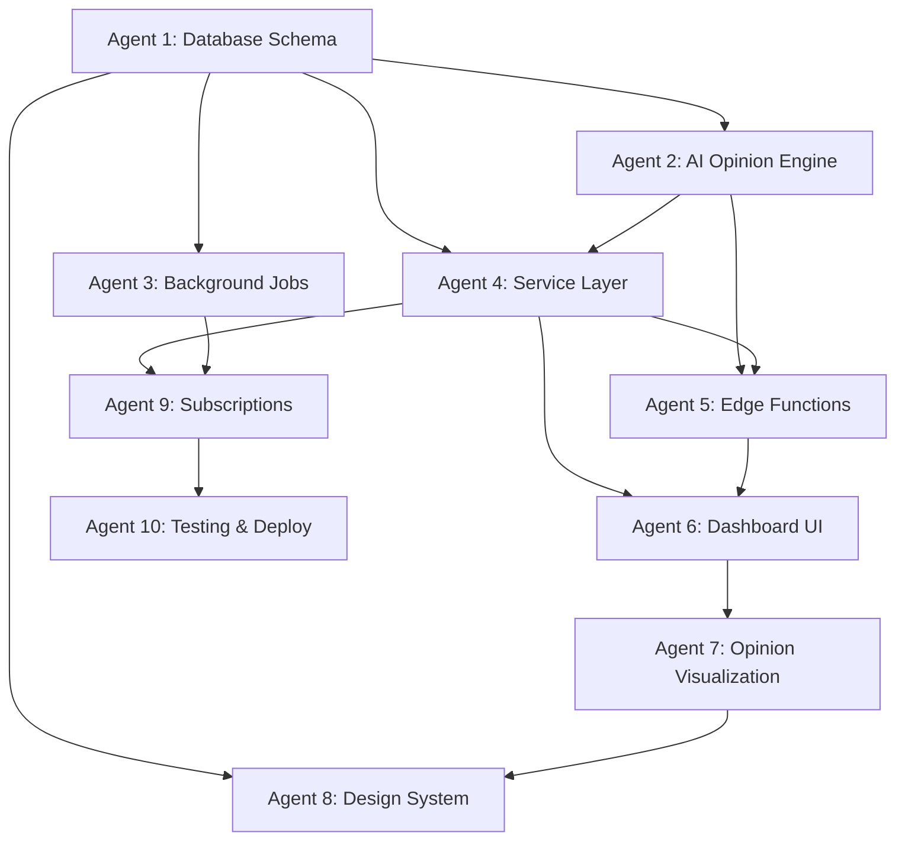

# Vibes Radar - AI Opinion Polling Platform Implementation Guide

## Overview

Vibes Radar is an AI-native opinion polling platform where users can ask "What does AI think about X?" and receive structured opinions from multiple AI models. It tracks sentiment trends, aggregates diverse AI perspectives, and visualizes how opinions evolve over time. Built with modern web technologies following next-forge conventions.

### Core Concept
Instead of tracking web analytics, Vibes Radar tracks AI opinions. Users create "radars" (topics to monitor), and the platform periodically polls various AI models to gather their perspectives, creating a unique view into the collective AI consciousness.

### Key Features
- **Real-time AI Interpretation**: Instant analysis of user queries via edge functions
- **Multi-Model Opinions**: Poll various AI models through OpenRouter
- **Trend Visualization**: Beautiful charts showing opinion evolution
- **Opinion Aggregation**: Combine multiple AI viewpoints into consensus
- **Subscription Tiers**: Free tier (2 radars), Premium (25+ radars)
- **Yutori-Inspired UI**: Minimal, elegant design aesthetic

## Architecture Overview

```
radar/
├── apps/
│   ├── app/         → Next.js frontend (RSC + SWR)
│   ├── ai/          → Mastra AI agents for opinions
│   └── api/         → Optional API server
└── packages/
    ├── @repo/api            → Service layer (RadarService, OpinionService)
    ├── @repo/auth           → Clerk authentication
    ├── @repo/biome-config   → Code formatting
    ├── @repo/cache          → Redis caching
    ├── @repo/database       → Prisma + PostgreSQL (radars, opinions)
    ├── @repo/design         → Tailwind v4 design system
    ├── @repo/inngest        → Background jobs (polling, trends)
    ├── @repo/rate-limit     → Upstash rate limiting
    └── @repo/shared         → Shared types and utils
```

## Implementation Timeline

| Phase | Duration | Agents | Focus Areas |
|-------|----------|--------|-------------|
| Phase 1: Core Data | 2-3 days | Agents 1-3 | Database, AI Engine, Background Jobs |
| Phase 2: Services | 2 days | Agents 4-5 | Service Layer, Edge Functions |
| Phase 3: Frontend | 3-4 days | Agents 6-8 | Dashboard, Visualizations, Design |
| Phase 4: Platform | 2-3 days | Agents 9-10 | Subscriptions, Testing, Deployment |
| **Total** | **9-12 days** | **10 agents** | Full Implementation |

## Agent Dependencies



## Key Features to Implement

### Core Functionality
- **Radar Creation**: Users define topics they want AI opinions on
- **Opinion Polling**: Scheduled collection of AI perspectives
- **Trend Analysis**: Track how opinions change over time
- **Real-time Interpretation**: Instant AI analysis of queries
- **Opinion Cards**: Beautiful display of individual AI thoughts
- **Consensus View**: Aggregated opinion with confidence scores

### AI Features
- **Multi-Model Support**: GPT-4, Claude, Mixtral via OpenRouter
- **Opinion Diversity**: Different models provide varied perspectives
- **Confidence Scoring**: How certain the AI is about its opinion
- **Sentiment Analysis**: Positive/negative/neutral classification
- **Related Topics**: AI suggests similar topics to explore
- **Opinion Evolution**: How a model's view changes over time

### Platform Features
- **Free Tier**: 2 radars, daily polling, 5 manual refreshes/month
- **Premium Tier**: 25+ radars, hourly polling, 500 refreshes/month
- **Public Radars**: Share your radar results with the community
- **Trend Alerts**: Notifications when opinions shift significantly
- **Export Data**: Download opinion history as CSV/JSON
- **API Access**: Programmatic access to radar data (premium)

## Technology Stack

### Frontend
- **Next.js 15+**: App Router with React Server Components
- **React 19+**: UI framework
- **TypeScript**: Type safety throughout
- **Tailwind v4**: Next-gen styling system
- **SWR**: Client-side data fetching
- **Recharts**: Trend visualization

### Backend
- **Prisma**: Type-safe database ORM
- **PostgreSQL**: Primary database (Neon)
- **Redis**: Rate limiting (Upstash)
- **Inngest**: Background job processing

### AI/ML
- **Mastra**: AI orchestration framework
- **OpenRouter**: Access to multiple AI models
- **Zod**: Schema validation for AI responses
- **XML Prompts**: Structured prompt engineering

### Infrastructure
- **Vercel**: Edge deployment
- **Clerk**: Authentication
- **Stripe**: Subscription billing
- **Biome**: Code formatting

## Core User Journey

1. **Create Radar**
   - User enters a topic: "Best coffee shops in SF"
   - AI interprets the query in real-time
   - System suggests polling frequency

2. **Initial Opinion**
   - Multiple AI models analyze the topic
   - Each provides a structured opinion
   - Results displayed as beautiful cards

3. **Track Trends**
   - Opinions polled periodically
   - Trend charts show evolution
   - Sentiment changes highlighted

4. **Share & Explore**
   - Make radar public (optional)
   - Browse community radars
   - Export data for analysis

## Success Metrics

### Phase 1 (MVP)
- ✅ Users can create and manage radars
- ✅ AI generates meaningful opinions
- ✅ Basic trend visualization works
- ✅ Free tier limits enforced
- ✅ Clean, minimal UI deployed

### Phase 2 (Premium)
- ✅ Stripe subscription flow complete
- ✅ Premium features unlocked
- ✅ Hourly polling for premium users
- ✅ Advanced visualizations
- ✅ Export functionality

### Phase 3 (Scale)
- ✅ Handle 10K+ concurrent radars
- ✅ < 5s interpretation latency
- ✅ Multi-region deployment
- ✅ Public radar marketplace
- ✅ API for developers

## Implementation Principles

### Architecture
- **RSC First**: Use React Server Components by default
- **Edge When Needed**: Real-time features on the edge
- **Type Safety**: Zod schemas for all external data
- **Service Layer**: Clean separation of concerns

### AI Integration
- **Structured Output**: Always use Zod schemas
- **Prompt Engineering**: XML templates for consistency
- **Error Handling**: Graceful fallbacks for AI failures
- **Cost Control**: Smart caching and rate limiting

### User Experience
- **Instant Feedback**: Real-time interpretation
- **Progressive Enhancement**: Works without JS
- **Beautiful Defaults**: Yutori-inspired aesthetics
- **Clear Limits**: Transparent about tier restrictions

## Getting Started

1. **Review Documentation**
   - Read this overview thoroughly
   - Check your assigned agent guide
   - Understand the dependencies

2. **Set Up Environment**
   ```bash
   # Clone repository
   git clone [repo-url]
   cd radar
   
   # Install dependencies
   pnpm install
   
   # Set up environment
   cp .env.example .env.local
   ```

3. **Begin Implementation**
   - Start with your agent's scope
   - Follow the detailed guide
   - Test incrementally
   - Document any deviations

## Next Steps

Begin with Agent 1 (Database Schema) to establish the data foundation for the opinion polling system. Each subsequent agent builds upon this foundation, creating a unique platform for exploring AI perspectives.